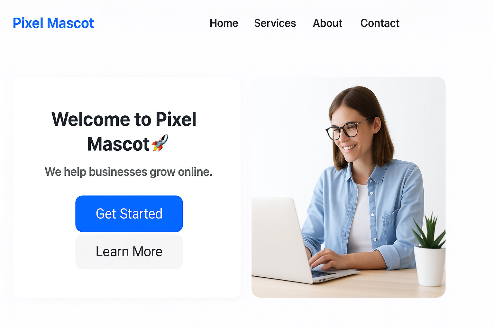

# Pixel Mascot Landing Page 🚀

A simple and responsive landing page built using **HTML** and **CSS**.

## 🔹 Features
- Responsive navigation bar
- Hero section with text, image, and buttons
- Mobile-friendly layout
- Clean and modern design

## 🔗 Live Demo
👉 [View it here](https://jaswanth1013.github.io/pixel-landing/)

## 📚 What I Learned
- HTML layout structure
- CSS styling and Flexbox
- Responsive design using media queries
- Hosting a project using GitHub Pages

## 📬 Contact
- LinkedIn: [Jaswanth Kumar](https://www.linkedin.com/in/jaswanth-kumar-petrum-6a47432a1)
- Email: jaswanthkumar1013@gmail.com
